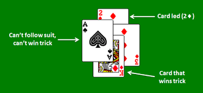
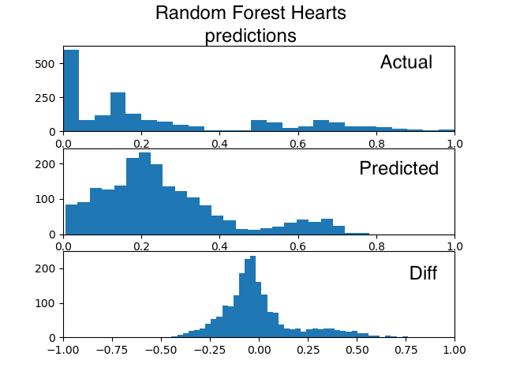
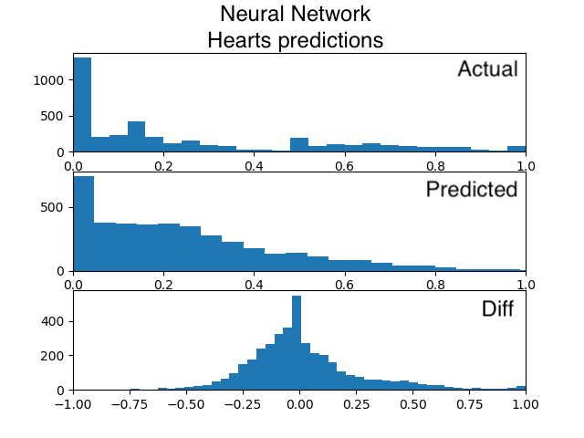
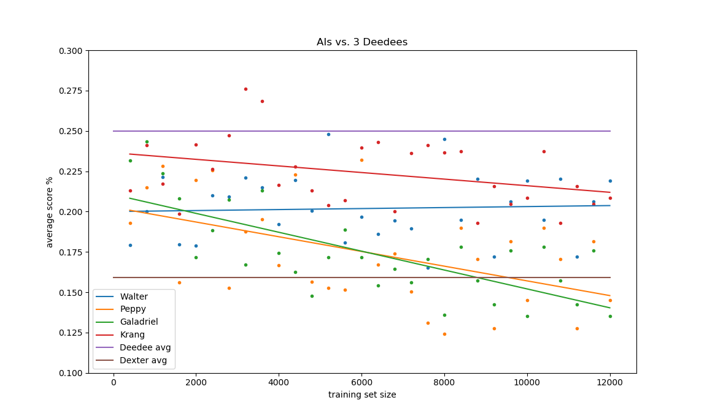
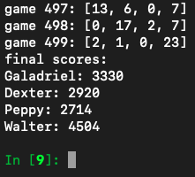

# Hearts AI

## Abstract
- Use machine learning to make an AI to play the card game Hearts.
- The AIs should play better than randomly, and should be compared to a hand-scripted AI.
- Observe how the AIs adapt to changes in the rules, to see how well ML can be used to balance a game design.
- It's also fun to play with! 

## Background
- Hearts is a "trick taking game", in the same family as Spades, Bridge, Pinochle, and Euchre. 
- A game is split into hands - your group plays as many hands as you want.
- Each hand, the entire deck of 52 cards is dealt. Each of the four players has 13 cards.
- A hand is split up into 13 "tricks" in which each player takes turns playing 1 card.
- Subsequent cards in the trick must follow the suit of the led card.
- The on-suit card with the highest rank wins the trick, collects the four cards, and leads the next trick.
- If you cannot follow suit, you play any card you want.
- **points are bad in hearts!**
- You get 1 point for winning a Heart, and 13 points for winning the Queen of Spades.
- The 2 of clubs leads the first trick of the hand.
- If a player gets all 26 points, they "shoot the moon" and all other players recive 26 points instead.
- Normally, each hand begins with a phase in which you pass 3 of your cards to another player. This phase is skipped for the machine learning algorithm. I was more interested in how it played hands.

## Preparation
- The game is implemented using the model-view-controller pattern and functional programming techniques. The View is made of immutable data structures, the Model is written in continuation-passing style, and the Controllers use pure functions. This allows for easy "look ahead" calculations, ease of multithreading, and ease of use in general.  
- Before writing the machine learning controllers, I implemented some basic AIs with hand-scripting, as well as a human input controller that uses standard Python IO.
- The machine learning AIs operate by iterating through their legally playable cards, calculating the estimation of what their final score will be if that card is played, and then picking the move with the lowest estimation.
- A controller that looked more than one move ahead was written, but did not siginificantly improve any AI's performance. 

## Cast of AIs
- Deedee: Deedee plays completely randomly. 
- Dexter: Dexter is a hand-scripted AI that plays intelligently. 
- Peppy: Peppy uses the Gradient Boost algorithm.
- Galadriel: Galadriel uses the Random Forest algorithm.
- Krang: Krang is a neural network. 
- Walter: Walter uses a Linear Regression model. 
- \<name\>\*: A version of the same ML algorithm that looks 2-3 moves ahead instead of just 1.

## Data
- The data used to train the AIs is generated by the program. 
- 2 Dexters and 2 Deedees play a large number of simulated games.
- From each game, 4 random game states (of 52 possible game states) are chosen.
- These are featurized into the X value of the data set, *from the perspective of the player who played the most recent card.*
- Each game state is associated with the score that player got at the end of the hand, which is the y value.
- When all 52 game states are added to the data set, the result is a lot of redundant information and a weaker data set. Sampling fewer game states from more simulated games was the key to getting most of the algorithms to start noticing the bimodal distribution.

## Feature Engineering
- Converting a game state to a feature set had many iterations.
- Initially, I recorded the position of all 52 cards as far as the current player could see. Whether it was in their hand, whether it had been played and who played it. Whether it had been won and who won it. Whether it was currently on the board and who played it.
- This ended up being mostly noise. The algorithms only cared about self vs other. Which particular other player had done what action at what time was not relevant and just slowed down the training.
- More hints about the rules of the game were added via featurization.
    - how many points are in your hand.
    - the ratio of your card's rank to the lead rank.
    - whether your card is on-suit.
    - how many points does each player already have.
    - how many points is your played card worth.
    - are you leading the trick.
- These hints greatly improved performance of the algorithm. 

## Stats
- the distribution of scores for a hand of Hearts is bimodal. 3/4 of the players did not win the Queen of Spades, and received a score from 0 to 13. 1/4 of players did win the Queen of Spades, and recieved a score from 13-25. 
- When the models were unable to predict this bimodal distribtion, they were unable to avoid getting the Queen of Spades, which was a serious blow to their effectiveness. They cannot even defeat Deedee consistently without understanding the Queen.
- There are spikes at 0, 4, 13, and 17. This is due to the combination of the Queen and the fact that hearts are often won in groups of 4 - in the situation that the lead card was a heart.
- Getting a score of 0 is especially common for intelligent players, because they can win "safe" 0 point tricks early in the hand and get rid of their high rank cards while maintaining control of the flow of the game. 
- In fact, when inspecting Walter's coefficients, the winner of the 2 of clubs (the first trick) was highly correlated with having a low score - it was often the most or second most significant coeficient.
- There is a very high variance in scores, because it's a game with a lot of randomness and hidden information. Even AIs that are very good at avoiding the Queen can still be stuck with a bad hand that makes winning her all but inevitable. (for instance, if the King of Spades is your only spade, and Deedee leads with the Queen.)
- This means that many games have to be played to measure the effectiveness of an AI.

## Results
- All of the algorithms are able to beat Deedee consistently.
- Peppy is able to beat Dexter if given enough data.
- Galadriel can keep pace with Dexter. Galadriel requires the least amount of data to understand the Queen.
- Krang is weak. The hyper-parameters probably need more tuning. Neural networks are hard.
- Walter does the best with little data. 
- It's not clear that the AIs were able to understand shooting the moon. Their highest error is typically 1.0, which is a game where they predict a score of 0 but actually recieve a score of 26 (because someone else shot the moon.)

## Game Design
- Removing the Queen of Spades rule from the game (by making it worth 0 points and making hearts worth 2 points each) results in the AIs finding the game much easier to understand. They do not have to predict a bimodal distribution in order to defeat Deedee. It also reduces the variance.
- The Queen and shooting the moon are "swingy" game mechanics - their purpose is to make the game a little more random so that, for instance, the oldest sibling doesn't just win every game. I've determined that these mechanics succeed in this goal, as they both increase the variance of the scores and make the difference between Deedee and other AIs less pronounced.
- The player who wins the first trick appears to have a significant advantage.

